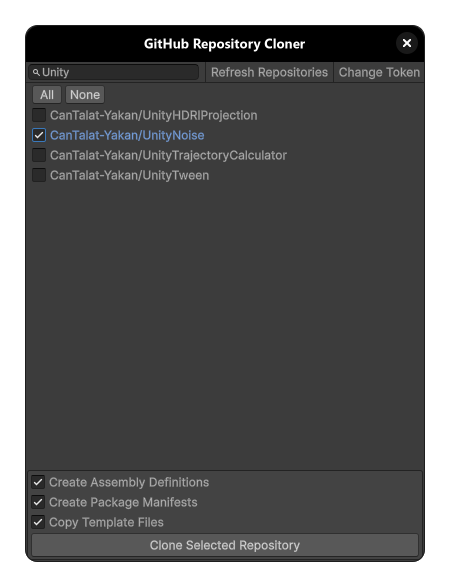

# Unity Essentials

This module is part of the Unity Essentials ecosystem and follows the same lightweight, editor-first approach.
Unity Essentials is a lightweight, modular set of editor utilities and helpers that streamline Unity development. It focuses on clean, dependency-free tools that work well together.

All utilities are under the `UnityEssentials` namespace.

```csharp
using UnityEssentials;
```

## Installation

Install the Unity Essentials entry package via Unity's Package Manager, then install modules from the Tools menu.

- Add the entry package (via Git URL)
    - Window → Package Manager
    - "+" → "Add package from git URL…"
    - Paste: `https://github.com/CanTalat-Yakan/UnityEssentials.git`

- Install or update Unity Essentials packages
    - Tools → Install & Update UnityEssentials
    - Install all or select individual modules; run again anytime to update

---

# GitHub Repository Cloner

> Quick overview: Clone multiple GitHub repositories into your Unity project with a stored HTTPS personal access token. Filter, multi-select, and optionally scaffold asmdef/package/templates. LFS-aware.

Clone multiple GitHub repositories directly into your Unity project from a simple editor window. Authenticate with a GitHub Personal Access Token (PAT), filter and select repos, and optionally scaffold each repo with an assembly definition, a package manifest, and your own templates - all in one go.



## Features
- Authenticate with a GitHub PAT and fetch up to 100 repositories linked to your account
- Filter and multi-select (All/None)
- Clone into a folder you select in the Project window (under Assets)
- Optional post-clone steps:
  - Create `.asmdef` (e.g., `UnityEssentials.<PackageName>`, root namespace `UnityEssentials`)
  - Create `package.json` with sensible defaults
  - Copy files from `Assets/Templates` into each cloned repo
- Git LFS awareness: runs `git lfs pull` when the repo uses LFS

## Requirements
- Unity Editor 6000.0+ (Editor-only; no runtime code)
- Git installed and available on your PATH
- Personal Access Token (PAT) for HTTPS operations (stored in EditorPrefs as `GitToken`)
- Optional: Git LFS if repositories use LFS

Tip: If the tool can’t find Git/LFS, install them and restart Unity so PATH updates are picked up.

## Menu Commands
- Assets → GitHub Repository Cloner
  - Opens the cloner window
  - Enabled when a valid folder (or an asset inside a folder) is selected
  - Clones repositories into the selected folder under `Assets/`

Selection logic: Select any folder (or asset) in the Project window; the tool resolves the on‑disk path and uses that as the clone target.

## Usage
1) Select a target folder in the Project window (under `Assets/`)
2) Open: Assets → GitHub Repository Cloner
3) Enter and save your GitHub token (stored in EditorPrefs as `GitToken`)
4) Filter and select repositories (use All/None for bulk selection)
5) Choose optional post-clone steps (Asmdef, Package, Templates)
6) Click Clone; progress is shown and the Asset Database refreshes on completion

## What It Generates (optional)
- Assembly definition (`.asmdef`)
  - Name: `UnityEssentials.<PackageName>`; Root namespace: `UnityEssentials`
  - Existing `*.asmdef` at the repo root are removed first to avoid duplicates
- Package manifest (`package.json`)
  - Name: `com.unityessentials.<packagename>`; Display Name: `UnityEssentials <PackageName>`; Unity: `6000.0`
  - Version: `1.0.0`; Description: `This is a part of the UnityEssentials Ecosystem`; Author: `Unity Essentials`
- Templates
  - Recursively copies everything (skips `.meta`) from `Assets/Templates` into the repo

## Configuration Defaults
You can tweak defaults in `Editor/GitHubRepositoryCloner.cs`:
- DefaultOrganizationName: `UnityEssentials`
- DefaultAuthorName: `Unity Essentials`
- DefaultUnityVersion: `6000.0`
- DefaultDescription: `This is a part of the UnityEssentials Ecosystem`
- ExcludeString: `Unity` (removed from repo folder to form PackageName)
- TemplateFolder: `Assets/Templates`

## Notes and Limitations

- Token storage
    - Your PAT is stored in Unity’s EditorPrefs under `GitToken`. Use Change Token to clear it.
- Token in clone URL and remotes
    - The clone URL embeds your token (`https://<TOKEN>@github.com/...`). Some Git versions may persist this in `.git/config`.
    - After cloning, you can remove the token from the remote:
      ```bash
      git remote set-url origin https://github.com/<owner>/<name>.git
      ```
- Pagination: only the first 100 repositories are fetched from the GitHub API
- Existing folders: repos are filtered out if any existing folder under `Assets/` shares the same final folder name
- Menu availability: the Assets → GitHub Repository Cloner menu is enabled only when a valid folder (or asset inside one) is selected
- Token header: uses the `token` auth scheme for the GitHub API request

## Files in This Package
- `Editor/GitHubRepositoryCloner.cs` – Core logic (token handling, GitHub API fetch, filtering, clone, optional asmdef/package/templates, LFS)
- `Editor/GitHubRepositoryClonerEditor.cs` – Editor window UI (token input, repo list, selection and actions)
- `Editor/UnityEssentials.GitHubRepositoryCloner.Editor.asmdef` – Editor assembly definition

## Tags
unity, unity-editor, git, github, clone, lfs, asmdef, package, templates, editor-tool, workflow, token, pat
